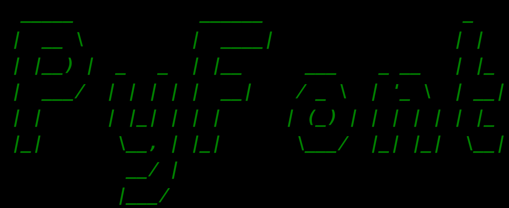

# PyFont

[](http://shields.io/#your-badge)
[](https://github.com/prnvdixit/Pyfont/blob/master/LICENSE)
[](https://github.com/prnvdixit/Pyfont/fork)



## Description

PyFont is a command-line application to detect fonts of text in images. It can be configured to include fonts existing in the system (eg. paid ones) as well.

## Dependencies

- [Python 3.*](https://www.python.org/)
- [OpenCV](https://opencv.org/)
- [Argparse](https://pypi.org/project/argparse/)
- [Numpy](https://www.numpy.org/)
- [Selenium Webdriver](https://www.seleniumhq.org/download/)
- [Pytesseract](https://pypi.org/project/pytesseract/)

## Setup

Download the dependencies for your respective system.

```
git clone https://github.com/prnvdixit/Pyfont.git
cd Pyfont/
python3 main.py -i <image_path> <path_to_ttf_directory>
```

## Working

Tesseract library is first used for OCR - Detecting text from the image supplied. The input image is cropped to text only (omitting out the unnecessary parts and borders). The text obtained from OCR is checked against different fonts (using the ttf-directory, supplied through commandline arguments) and is checked using image similarity algorithms for best matches.

## Known Issues

- Similarity doesn't seem like best possible way to compare fonts (Mostly as after pre-processing input image, some chars get distorted).
- Currently, saving intermediate images is the only way I can come up with - It's a bottleneck in the functioning.

## Future work

- Add rotational invariance for input images
- Use Google API (give a cmd arguement for same) instead of downloading the .ttf files
- Add tests

## Contributors

* **Pranav Dixit** - [*GitHub*](https://github.com/prnvdixit) - [*LinkedIn*](https://www.linkedin.com/in/prnvdixit/)

## License

See the LICENSE.md file for license rights and limitations (MIT).
